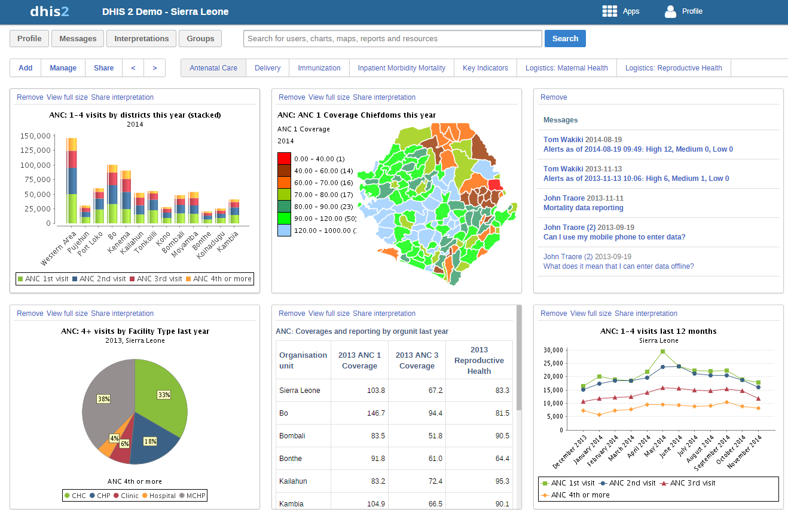
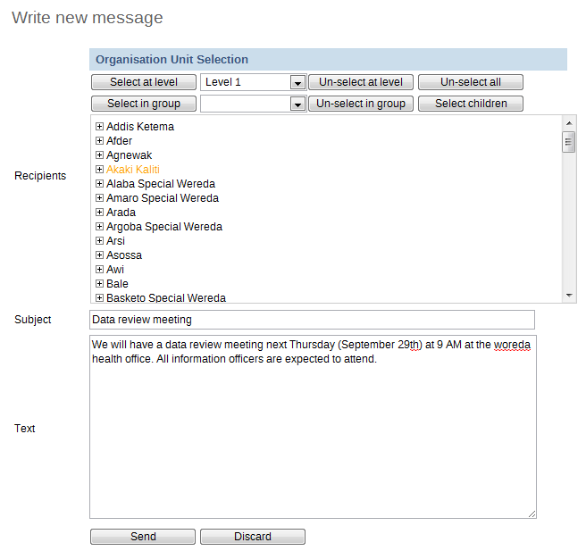
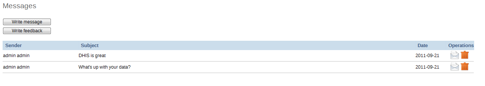

..index:: Dashboards

Dashboards
==========
Dashboards are intended to provide quick access to different analytical objects (maps, charts, reports, tables, etc) to an individual user. Dashboards can also be shared with user groups. For instance, a user or administrator could create a dashboard called "Malaria" which might contain all relevant information on malaria. This dashboard could then be shared with the user group called "Malaria contol", which might consist of all users of the malaria control programme. All users within this group would then be able to view the same dashboard.

Setting up the dashboard
========================
The dashboard can contain any number of objects (charts, maps, reports, tables, resources, etc). These can be freely arranged on the dashboard as you wish.

.. _dashboard_main:

In this screen shot, the dashboard has already been populated with a number of objects, such as charts, map views, tables and messages. Simply clicking on one of the blue links will bring you automatically to the object. Maps, charts and tables can be viewed as full size as images (in the case of charts and map views) or as HTML resources (in the case of reports, tables and messages).

To reorder how the dashboard appears, simply drag-and-drop any of the objects to a new position.

If you would like to share an interpretation of an object (such as a chart of map), click "Share interpretation". You interpretation will be shared publicly with other users of the iROAD2 system, in the "Interpretation" section of the dashboard.

Messages and feedback
=====================
iROAD2 has certain functions to facilitate communication between different users and user groups. This type of communication is important to facilitate feedback regarding data quality, timeliness of submissions, or to simply answer a question which a particular user may have.

Feedback messages are sent to a particular group of users and can be sent by all users who have access to the dashboard module. In order to enable the receipt of feedback messages sent from the dashboard, you must set the system setting "Feedback recipients" which is available from the Maintenance->System settings dialog. Be sure to define a user group (e.g. "Feedback recipients") with all of the users who should receive feedback messages. Refer to the section in this manual on "User groups" for more information of how to do this. Once the "Feedback recipients" user group has been defined, each time a feedback message is sent, it will appear as a message in each of the "Feedback recipients" message queue within iROAD2. Note that messages will not be sent to users email addresses, but will only appear within the iROAD2 application.

To send a new feedback message, simply select "Write feedback" from the dashboard. Provide a subject and text in the respective text boxes. The message will appear in all of the specified users message queue.

Messages can be sent to specific groups of users who have been assigned to particular organisation units. To write a new message, simply click "Messages" from the dashboard screen and then press the "Write message" button.. Select an organisation unit (or group of organisation units) from the "Recipients" organisational unit tree. Provide a Subject and Text. To send the message, press the "Send" button. You can discard the message by pressing the "Discard" button as seen in the screenshot below.

.. _dashboard_messages:

To read messages which have been sent to you, select "Messages" from the "Dashboard" . You messages will be displayed as a list. Click the desired message to read all of the messages in this particular conversation.

.. _dashboard_message_queue:

   

