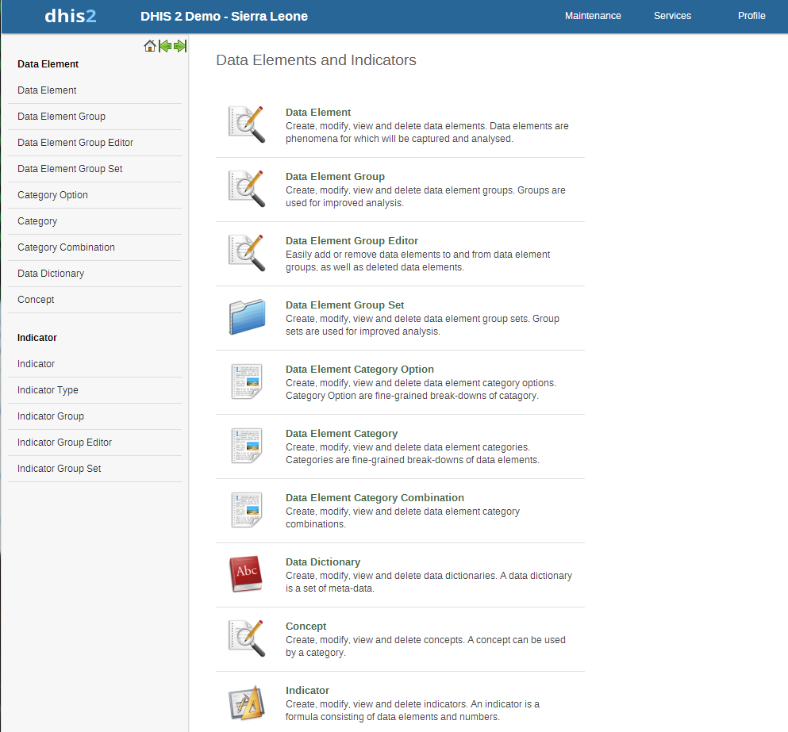

..index:: System Settings

System Settings
===============

The data administration module provides a range of functions to ensure that the data stored in the iROAD2 database is
integral and that the database performance is optimised. These functions should be executed on a regular basis by a
data administrator to ensure that the quality of the data stored is optimal.

Data browser
============

The data browser maintenance and analysis module which allows the user to produce a summary of the data contained
in the iROAD2 database. The summary view provides a count of data elements which have been entered at the selected
organisation unit as well as its descendants. Raw data for all data elements for a range of time periods and a given
organisational unit can be browsed and exported to Excel, CSV, or PDF formats. There are four modes of the data
browser, which determine how the data is summarized

* Data sets
* Data element groups
* Organisational unit groups
* Organisational units

Each of these options can be accessed by selecting the desired option from "Browse by" drop-down menu.
In order to produce a summary of submitted data for a given period and grouped by data sets, the user should follow
this procedure. Begin by selecting a given periodicity type (e.g. Weekly, monthly, yearly, etc) and then a "From date"
and "To date". (e.g. January 2009 to March 2009). Select the type of summary to be produced (e.g. Dataset) from the
"Browse by" drop-down menu. Click the "Browse" button to view the summary.

.. _data_elements:

   
A summary of the number of data element values that have been submitted over the user selected time period is shown
below.

Data integrity
==============
iROAD2 can perform a wide range of data integrity checks on the data contained in the database. Identifying and
correcting data integrity issues is extremely important for ensuring that the data used for analysis purposes is valid.
Each of the data integrity checks that are performed by the system will be described, along with general procedures
that can be performed to resolve these issues.

Data elements without data set
------------------------------

Each data element must be assigned to a data set. Values for data elements will not be able to be entered into the system
if a data element is not assigned to a data set. Choose Maintenance->Datasets->Edit from the main menu and then add
the "orphaned" data element to the appropriate data set.

Data elements without groups
----------------------------

Some Data Elements have been allocated to several Data Element Groups. This is currently not allowed, because it will
result in duplication of linked data records in the analytics record sets that provide aggregated data. Go to Maintenance
-> Data Element Groups to review each Data Element identified and remove the incorrect Group allocations.

Data elements violating exclusive group sets
--------------------------------------------

Some data elements have been allocated to several data element groups that are members of the same data element
group set. All group sets in iROAD2 are defined as exclusive, which means that a data element can only be allocated
to one data element group within that group set. Go to Maintenance -> Data elements and indicators ->Data element
groups to review each data element identified in the integrity check. Either remove the data element from all groups
except the one that it should be allocated to, or see if one of the groups should be placed in a different group set.

Data elements in data set but not in form or sections
-----------------------------------------------------
Data elements have been assigned to a data set, but have not been assigned to any sections of the data set forms. All
data sets which use section forms, should generally have all data elements in the data set assigned to exactly one section
of the dataset.

Data elements assigned to data sets with different period types
---------------------------------------------------------------
Data elements should not be assigned to two separate data sets whose period types differ. The recommended approach
would be to create two separate data elements (for instance a monthly and yearly data element) and assign these to
respective datasets.

Data sets not assigned to organisation units
--------------------------------------------
All data sets should be assigned to at least one organisation unit.

Sections with invalid category combinations
-------------------------------------------
Data sets which use section forms should only have a single category combination within each section. This violation
could result from assigning a data element to a section, but then changing the category combination of this data element
at a later point in time.

Indicators with identical formulas
----------------------------------
Although this rule will not affect data quality, it generally does not make sense to have two indicators with the exact
same definition. Review the identified indicators and their formulas and delete or modify any indicator that appears
to be the duplicate.

Indicators without groups
-------------------------
All data elements and indicators must be assigned to at least one group, so these Indicators need to be allocated to their
correct Data Element and Indicator Group. From the main menu, go to Data elements/Indicators -> Indicator Groups,
and allocate each of the `Orphaned` indicators to its correct group.

Invalid indicator numerators
----------------------------
Violations of this rule may be caused by an incorrect reference to a deleted or modified data element. Review the
indicator and make corrections to the numerator definition.

Invalid indicator denominators
------------------------------
Violations of this rule may be caused by an incorrect reference to a deleted or modified data element. Review the
indicator and make corrections to the denominator definition.

Indicators violating exclusive group sets
-----------------------------------------
Some indicators have been allocated to several indicator groups that are members of the same indicator group set. All
group sets in iROAD2 are defined as exclusive, which means that an indicator can only be allocated to one indicator
group within that group set. Go to Maintenance -> Data elements and indicators ->Indicator groups to review each
indicator identified in the integrity check. Either remove the indicator from all groups except the one that it should be
allocated to, or see if one of the groups should be placed in a different group set.

Duplicate periods
-----------------
If periods have been imported from external applications, it may be possible that some periods will be duplicated. If
you have any periods which appear to be duplicated here, you will need to resolve these directly in the iROAD2 database.
All data which has been assigned to the duplicated period, should be moved to the correct period, and the duplicate
period should be removed.

Organisation units with cyclic references
-----------------------------------------

Organisation units cannot be both parent and children of each other, directly nor indirectly. If this situation occurs, you
will need to resolve the cyclic reference directly in the iROAD2 datrabase in the "organisationunit" table, by reassigning
the "parentid" field of the organisation units.

Orphaned organisation units
----------------------------
All organisation units must exist within the organisation unit hierarchy. Go to Organisation- units >Hierarchy
Operations and move the offending organisation unit into the proper position in the hierarchy.

Organisation units without groups
---------------------------------
All organisation units must be allocated to at least one group. The problem might either be that you have not defined any
compulsory OrgUnit Group Set at all, or that there are violations of the compulsory rule for some OrgUnits . NOTE: If
you have defined no compulsory OrgUnit Group Sets, then you must first define them by going to Organisation units>Organisation unit group sets and define at least one compulsory Group Set (the group set 'Type' are nearly universally
relevant). If you have the relevant group sets, go to Maintenance -> OrgUnit Groups to review each OrgUnit identified
and add the relevant Group allocation.

Organisation units violating compulsory group sets
--------------------------------------------------
These organisation units have not been assigned to the any organisation unit group within one of the compulsory
organisation unit group sets. When a group set is defined as compulsory, it means that an organisation unit must be
allocated to at least one organisation unit group within that group set. For instance, all organisation units must belong to
one of the groups in the 'Type' group set. It might belong to the `Hospital` or the `Clinic` or any other 'type' group - but
it must belong to exactly one of them. Go to Organisation units->Organisation unit groups to review each organisation
unit identified in the integrity check. Allocate all organisation units to exactly one compulsory group.

Organisation units violating exclusive group sets
-------------------------------------------------
Some organisation units have been allocated to several organisation unit groups that are members of the same
organisation unit group set. All group sets in iROAD are defined as exclusive, which means that an organisation unit
can only be allocated to one organisation unit group within that Group Set. For instance, one organisation unit cannot
normally belong to the both the 'Hospital' and 'Clinic' groups , but rather to only to one of them. Go to Organisation unit-
>Organisation unit groups to review each organisation unit identified in the integrity check. Remove the organisation
units from all groups except the one that it should be allocated to.

Organisation unit groups without group sets
-------------------------------------------
The organisation unit groups listed here have not been allocated to a group set. Go to Maintenance->Organisation unit-
>Organisation unit group sets and allocate the Organisation unit group to the appropriate group set.

Validation rules without groups
-------------------------------
All validation rules must be assigned to a group. Go to Data quality->Validation rule group and assign the offending
validation rule to a group.

Invalid validation rule left side expressions
---------------------------------------------
An error exists in the left-side validation rule definition. Go to Data quality->Validation rule and click the "Edit"
icon on the offending rule. Press "Edit left side" and make the corrections that are required.

Invalid validation rule right side expressions
----------------------------------------------
An error exists in the left-side validation rule definition. Go to Data quality->Validation rule and click the "Edit"
icon on the offending rule. Press "Edit right side" and make the corrections that are required.

Maintenance
===========
The data maintenance module has five options, each described below.

* Clear analytics tables

Completely empties the analytics tables. These tables are used to generate aggregate data for the pivot tables, GIS
and reports.

* Clear data mart (aggregated indicator and data value values)

The data mart is where iROAD 2 stores aggregated data produced during the export to data mart process. This function
empties the database table which contains aggregated indicator and data element values.

* Rebuild data mart index

Rebuilds the database indexes on the aggregated data generated during a data mart process.

* Clear zero values

This function removes zero data values from the database. Values registered for data elements with aggregation
operator average is not removed, as such values will be significant when aggregating the data, contrary to values
registered for data elements with aggregation operator sum. Reducing the number of data values will improve system
performance.

* Clear dataset completeness

This function empties the aggregated dataset completeness value table. This data is produced and used by report
tables.

* Prune periods

This function removes all periods which have no registered data values. Reducing the number of periods will improve
system performance.

* Remove expired invitations

Will delete users which represent user account invitations that now have gone past their expiry date.

* Create SQL views

* Will recreate all SQL views in the database.

* Update category option combinations

Rebuilds the category option combinations. This may be required after altering the category options which belong
to a given category.

Resource tables
===============

Resource tables are supporting tables that are used during analysis of data. One would typically join the contents of
these tables with the data value table when doing queries from third-party applications like Microsoft Excel. They are
also used extensively by the analysis modules of iROAD2. Regeneration of the resource tables should only be done once
all data integrity issues are resolved. The resource tables are also generated automatically, every time the analytics
process is run by the system.

* Organisation unit structure (_orgunitstructure)

This table should be regenerated any time there have been any changes made to the organisational unit hierarchy.
This table provides information about the organisation unit hierarchy. It has one row for each organisation unit, one
column for each organisation unit level and the organisation unit identifiers for all parents in the lineage as values.

* Data element group set structure (_dataelementgroupsetstructure)

This table provides information about which data elements are members of which data element group sets. The table
has one row for each data element, one column for each data element group set and the names of the data element
group as values.

* Indicator group set structure (_indicatorgroupsetstructure)

This table provides information about which indicators are members of which indicator group sets. The table has
one row for each indicator, one column for each indicator group set and the names of the indicator group as values.

* Organisation unit group set structure (_organisationunitgroupsetstructure)

This table provides information about which organisation units are members of which organisation unit group sets.
The table has one row for each organisation unit, one column for each organisation unit group set and the names
of the organisation unit groups as values.

* Category structure (_categorystructure)

This table provides information about which data elements are members of which categories. The table has one row
for each data element, one column for each category and the names of the category options as values.

* Data element category option combo name (_categoryoptioncomboname)

This table should be regenerated any time there have been changes made to the category combination names. It
contains readable names for the various combinations of categories.

* Data element structure (_dataelementstructure)

This table provides information about all data elements and which period type (frequency) they capture data at. The
period type is determined through the data set membership and hence relies on data elements to be member of data
sets with similar period types to have a defined behavior.

* Period structure (_dataperiodstructure)

This table provides information about all periods and which period type they are associated with. For each period
type with lower frequency than itself, it contains information about which period it will fall within.

* Data element category option combinations (_dataelementcategoryoptioncombo)

This table provides a mapping between data elements and all possible category option combinations.

Locale Management
=================

It is possible to create custom locales in iROAD2. In addition to the locales available through the system, you might
want to add a custom locale such as "English" and "Zambia" to the system. This would allow you to translate metadata
objects to local languages, or to account for slight variants between countries which use a common metadata definition.
The locale is composed of a language along with a country. Select the desired values and press "Add". This custom
locale will now be available as one of the translation locales in the system.

SQL View
========

The SQL View functionality of iROAD2 will store the SQL view definition internally, and then materialize the view
when requested.

Database administrators must be careful about creating database views directly in the iROAD 2 database. For instance,
when the resource tables are generated, all of them will first be dropped and then re-created. If any SQL views depend
on these tables, an integrity violation exception will be thrown and the process will be aborted.
The SQL views are dropped in reverse alphabetical order based on their names in iROAD 2, and created in regular
alphabetical order. This allows you to have dependencies between SQL views, given that views only depend on other
views which come earlier in the alphabetical order. For instance, "ViewB" can safely depend on "ViewA". Otherwise,
having views depending on other view result in an integrity violation error.

Creating a new SQL view
-----------------------
To create a new SQL view, choose Maintenance->SQL view and click the "Add new" button.

The "Name" attribute of the SQL view will be used to determine the name of the table that iROAD2 will create when
the view is materialized by the user. The "Description" attribute allows one to provide some descriptive text about
what the SQL view actually does. Finally, the "SQL statement" should contain the SQL view definition. Only SQL
"SELECT" statements are allowed and certain sensitive tables (i.e. user information) are not accessible Press "Save"
to store the SQL view definition.

SQL View management
-------------------
In order to utilize the SQL views, simply press the "Execute query" button from the "SQL View management
page. Once the process is completed, you will be informed that a table has been created. The name of the table will be
provided, and is composed from the "Description" attribute provided in the SQL view definition. Once the view has
been materialized, click on the "View" button

Organisation unit merge
=======================

This function is useful when two organisation units need to be merged, e.g. it is decided that one facility will be shut
down and its services will be provided by a nearby facility.

Start by selecting the organisation unit to eliminate from the tree and click confirm. Then select the organisation unit
to keep and click confirm again. Finally, verify the selection and click merge.

In the situation where data exist for the organisation unit to eliminate and not for the one to keep, the data will be
moved to the one to keep. When data exists for both organisation units, the data will be summarized and moved to
the one to keep. When data exists only for the one to keep, no action is taken. The organisation unit to eliminate will
eventually be deleted.

Duplicate data elimination
==========================
This function is useful when data has been entered mistakenly for two data elements which represents the same
phenomena.

Start by selecting the data element to eliminate from the list and click confirm. Then select the data element to keep
and click confirm again. Finally, verify the selection and click merge.

In the situation where data exists for the data element to eliminate and not for the one to keep, the data will be moved
to the one to keep. When data exists for both data elements, the data which was updated last will be used. When data exists only for the one to keep, no action will be taken. The data element to eliminate will eventually be deleted, except
when it is a multidimensional data element and has other data registered.

