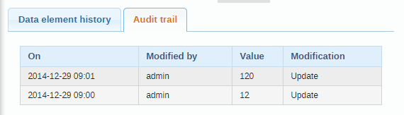
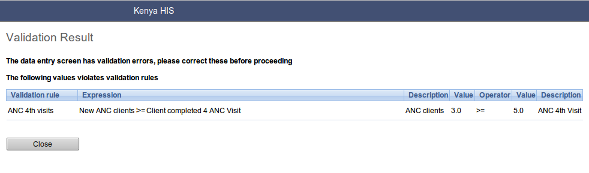

..index:: Data Entry

Data entry with iROAD 2
=======================

Data entry with iROAD 2
-----------------------
To open the data entry window click on the services tab displayed in the main menu. A drop down menu will appear listing the services provided by iROAD 2. Click on the Data Entry option.

The data entry module is where data is manually registered in the iROAD 2 database. Data is registered for an organisation unit, a period, and a set of data elements (data set) at a time. A data set often corresponds to a paper-based data collection tool.

Selecting the data entry form
^^^^^^^^^^^^^^^^^^^^^^^^^^^^^
To start entering data the first step is to open the correct form by following these steps:

#. Locate the orgunit you want to register data for in the tree menu to the left. Expand and close branches by clicking on the +/- symbols. A quick way to find an orgunit is to use the search box just above the tree (the green symbol), but you need to write in the full name to get a match.

#. Select a data set from the dropdown list of data sets available to your selected orgunit.

#. Select a period to register data for. The available periods are controlled by the period type of the data set (reporting frequency). You can jump a year back or forward by using the arrows above the period.

By now you should see the data entry form. From a form design perspective, there are three types for forms: default forms, section forms and custom forms. If a custom form exists, it will be displayed, followed in order of precedence by a section form, and finally a default form.

.. _data_entry_overview:
.. figure::  images/data_entry_overview.png
   :align:   center
   
Entering data
^^^^^^^^^^^^^
Start entering data by clicking inside the first field and type in the value. Move to the next field using the Tab button. Shift+Tab will take you back one step. You can also use the "up" and "down" arrow keys to navigate between the form cells. The values are saved immediately and do not require to be saved at a later stage. A green field indicates that the value has been saved in the system (on the server).

Input validation: If you type in an invalid value, e.g. a character in a field that only accepts numeric values you will get a pop-up that explains the problem and the field will be coloured yellow (not saved) until you have corrected the value. If you have defined a min/max range for the field (data element+organisation unit combination) a pop-up message will notify you when the value is out of range, and the value will remain unsaved until you have changed the value (or updated the range and then re-entered the value).

Disabled fields: If a field is disabled (grey) it means that the field can and should not be filled. The cursor will automatically jump to the next open field.

Data history: By double-clicking on any input field in the form a data history window opens showing the last 12 values registered for the current field (organisation unit+data element+categoryoptioncombo) in a bar chart. This window also shows the min and max range and allows for adjusting the range for the specific organisation unit and data element combination.

.. _data_entry_section_history:
.. figure::  images/data_entry_section_history.png
   :align:   center
   
Follow Up: In the data history window there is also a feature to tag or star a value. E.g. a suspicious value that needs further investigation can be kept in the system, but marked for Follow-Up. In the Data Quality module you can run a Follow-Up analysis and view all values marked for Follow-Up, and then later edit the values if proved incorrect.

Audit trail: The audit trail allows you to view other data values which have been entered prior to the current value. As an example, the following data element was changed from its original value to 120. The audit trail shows when the data value was altered along with which user made the changes.

.. _data_entry_audit_trail:

Editing and deleting data
^^^^^^^^^^^^^^^^^^^^^^^^^
If you wish to enter data which has already been entered, simply replace the data entry value with the update values.

If you want to delete a data value completely, you should select the value of interest, and press "Delete" on your keyboard. If you enter a zero and the data element has been configured to not store zeros, the previous data value (i.e. the one you wish to modify) will not be overwritten with the new value. Therefore, it is better practice to delete the data value completely (waiting for the cell to turn green) and then to enter the new value.

Validating data in the form
^^^^^^^^^^^^^^^^^^^^^^^^^^^
When all the available values for the form has been filled in you can run a validation check on the data in the form. Click on the "Run Validation" button in the top right corner. All validation rules which involves data elements in the current form (dataset) will be run against the new data. Upon completion you will be presented with a list of violations or a simply a message that says "The data entry screen successfully passed validation". See the Data Quality chapter for information on how to define such validation rules.

When you have corrected any erroneous values and are done with the form the recommended practice is to click on the Complete button below the form to register the form as complete. This information is used when generating completeness reports for district, county, province or the national level.

.. _data_entry_validation_result:

   
Offline data entry
^^^^^^^^^^^^^^^^^^
The data entry module will function even if during data entry the Internet connectivity is not stable. In order to utilize this functionality, you must login to the server while Internet connectivity is present, but if during data entry, the Internet link between your computer and the server becomes unstable, data can still be entered into the data entry form, saved to your local computer, and then pushed to the server once the Internet connectivity has been restored. Data can be entered and stored locally while being offline and uploaded to the central server when on-line. This means that the on-line deployment strategy will be more viable in areas with unstable Internet connectivity. The total bandwidth usage is greatly reduced since forms no longer are retrieved from the server for each rendering.

Multi-organisation unit data entry
^^^^^^^^^^^^^^^^^^^^^^^^^^^^^^^^^^
In some scenarios it is beneficial to enter data for multiple organisation units in the same data entry form, for instance if there are few data elements in the form and a huge number of organisation units in the hierarchy. In that case you can enable multi-organisation unit data entry by going to "System settings" and tick the "Enable multi organisation unit forms" setting. Then, in data entry, select the organisation unit immediately above the organisation unit you want to enter for in the hierarchy. Note that this only work for the "section" based forms. You should now see the data elements appearing as columns and the organisation units appearing as rows in the form. Note that the data entry forms should still be assigned to the facilities that you actually enter data for, i.e. the organisation units now appearing in the form.

Data entry with iROAD2 APPS
============================

iROAD2 APPS allows a user to interact with the system specifically by entering into a respective Module that provides a given service.

The following APPs provides a way to interact with iROAD2 depending the information the user wants from system.

#. Motor Vehicles Web APP.
#. Drivers Web APP
#. Accident Web APP
#. Offences Web APP.

Motor Vehicles Web APP
-----------------------
This is a web module that offers registrations of new motor vehicles and other services regarding motor vehicles like insuring and licensing.

Adding new Motor Vehicles to iROAD2 
^^^^^^^^^^^^^^^^^^^^^^^^^^^^^^^^^^^

The iROAD2 Web APP offers a place to register new motor vehicles into the system.

The web Motor Vehicle APP allows you to;

#. Register a new motor vehicle.
#. Edit an existing motor vehicle.
#. Add Insurance to a vehicle.
#. Do Vehicle Inspection.
#. Add a Business Licence to a vehicle.
#. View Accidents (if any) that a particular vehicle has encoutered.
#. View Offences (if any) that a particular vehicle has encoutered.

   
Motor Vehicle web APP
^^^^^^^^^^^^^^^^^^^^^
The  Motor Vehicle web APP can be found by clicking on the services tab displayed in the main menu. 

A drop down menu will appear listing the services provided by iROAD 2. Click on the Motor Vehicle APP option.

When the Motor Vehicle APP opens, a list of all registered vehicles will be shown in a table known as the vehicles data table.

Every row of this data contains a detailed information about a registered Motor Vehicle, and on every row of the Motor Vehicle data table,the following options are listed by cliking the (Action) button .

#. Adding or Registering a new Motor Vehicle.
#. Info.
#. Edit.
#. Delete.
#. Add Insurance.
#. Add Inspection.
#. Add Business Licence.
#. Add Vehicle Licence.
#. Insurance history.
#. Accidents.
#. Offences.

Adding a new Motor Vehicle
^^^^^^^^^^^^^^^^^^^^^^^^^^

When the Motor Vehicle APP opens, a list of all registered vehicle will be shown in a data table.

On top of this data table,an (Add Vehicle) button can be seen.

To add/register a new vehicle to iROAD2,follow the following procedures.

#. Click the Add Vehicle button and a right side-window will show up requiring you to provide the details of the vehicle.

#. After filling the required information, click the (Add) button to register this new vehicle.

#. Finally a successful pop-up message will show up informing the user that the vehicle is registered.

Viewing Vehicle(s) information
^^^^^^^^^^^^^^^^^^^^^^^^^^^^^^
Along with the data presented on each row of the data table there is an option of viewing the info of a vehicle.

On clicking the(Info) option on the vehicles data table above, a right side window showing all the information of the chosen vehicle will occur.

To cancel this side window, click close button on the right top corner of this window. 

Editing vehicle information
^^^^^^^^^^^^^^^^^^^^^^^^^^^
If you wish to edit the information on any vehicle,click on the edit option.

On clicking the(Edit) option on the vehicles data table above, a right side bar having the information on the vehicle to be edited will open up.

Edit the information you need to edit and click the done button.

Deleting vehicle information
^^^^^^^^^^^^^^^^^^^^^^^^^^^^
If you wish to delete the information on any vehicle,click on the delete option.

On clicking the(Delete) option on the vehicles data table above, a pop-up window will open, and you can hit the delete button on the pop-up window to delete the vehicle.

Insuring a  vehicle
^^^^^^^^^^^^^^^^^^^
You can insure a vehicle to an insurance companies using the motor vehicle application.

Inspecting  a  vehicle
^^^^^^^^^^^^^^^^^^^^^^
The motor vehicle application allows a trafic officer to inspect a vehicle and provide the results on the inspection done.

Accident Web APP
----------------
To open the Accident APP click on the services tab displayed in the main menu. A drop down menu will appear listing the services provided by iROAD 2. Click on the Accident APP option.

Adding a new Accident 
^^^^^^^^^^^^^^^^^^^^^

When the Accident APP opens, a list of all reported accidents will be shown in a table, and an (Add New Accident) button can be seen on top of the table.

To add a new Accident follow the following procedures.

#. Click the Add New Accident button and a pop-up window will show up requiring you to provide the details of the accident.

#. After filling the required information on the above pop-up window, click the (Save and Proceed) button.

#. Finally the last form will pop-up with a (Submit) button and on clicking it, the accident will be reported.

   
Viewing the reported accidents
^^^^^^^^^^^^^^^^^^^^^^^^^^^^^^
To view a reported Accident, click on the services tab displayed in the main menu. A drop down menu will appear listing the services provided by iROAD 2. Click on the Accident APP option.

When the Accident APP opens, a list of all reported accidents will be shown in a table.

On every row of the accident table, the following options are listed by cliking the (Action) button .

#. Info(View Accident Info).
#. Edit (Edit accident).
#. View vehicle(s) involved.
#. View driver(s) involved.
#. View Accident media

Viewing accident info
^^^^^^^^^^^^^^^^^^^^^
If you wish to view the information on any reported accident,this option is the way to go.

On clicking the(Info) option on the accidents table above, a pop-up window showing all the information o the chosen accident will occur.

To cancel this pop-up window, click outside the window and the window will collapse. 

Editing an  accident
^^^^^^^^^^^^^^^^^^^^
If you wish to edit the information on any reported accident,click on this option.

On clicking the(Edit Accident) option on the accidents table above, a right side bar having the information on the accident to be edited will open up.

Edit the information you need to edit and click the save button.

Viewing vehicles involved in an accident
^^^^^^^^^^^^^^^^^^^^^^^^^^^^^^^^^^^^^^^^

On the accident web app, you can also view the vehicles involved in an accident. This is achieved by clicking the View vehicle(s) option form the accident data table.

On clicking this button a table with vehicle details will show up below the major accidents data table.From this table you can also view the drivers involved in each vehicle when an accident occured.

Viewing accident Media
^^^^^^^^^^^^^^^^^^^^^^

Accident reported using android application come with attached photo and videos.In order to view these media files, click on the (View Accident Media).

On clicking this button, an interface showing the photo and video will show below the main accident data table.

Entering Offence data using Offence Web APP
---------------------------------------------
You can add an offence into the iROAD2 system by using the Offence Web APP.

To open the Offence APP click on the services tab displayed in the main menu. A drop down menu will appear listing the services provided by iROAD 2. Click on the Offence APP option.

Adding a new Offence 
^^^^^^^^^^^^^^^^^^^^^

When the Offence APP opens, a list of all reported offences will be shown in a table, and an (Add New) button can be seen on top of the table.

To add a new offence follow the following procedures.

#. Click the Add New Offence button and a right side window will show up requiring you to provide the details of the offence.

#. After filling the required information, click the (Done) button and the offence will be reported.

   
Viewing the reported offences
^^^^^^^^^^^^^^^^^^^^^^^^^^^^^^
To view a reported offence, click on the services tab displayed in the main menu. A drop down menu will appear listing the services provided by iROAD 2. Click on the Accident APP option.

When the Offence APP opens, a list of all reported offencees will be shown in a table.

On every row of the offence table,the following options are listed by cliking the (Action) button .
#. Info.
#. Edit.
#. View Offences.
#. View Payment.
#. View Offences.
#. View Vehicle.
#. View Driver.

Viewing offence info
^^^^^^^^^^^^^^^^^^^^^
If you wish to view the information on any reported offence,this option is the way to go.

On clicking the(Info) option on the offences table above, a pop-up window showing all the information of the chosen offence will occur.

To cancel this pop-up window, click outside the window and the window will collapse. 

Editing an offence
^^^^^^^^^^^^^^^^^^^^
If you wish to edit the information on any reported offence,click on the edit option.

On clicking the(Edit) option on the offences data table above, a right side bar having the information on the accident to be edited will open up.

Edit the information you need to edit and click the save button.

Viewing a vehicle involved in an offence
^^^^^^^^^^^^^^^^^^^^^^^^^^^^^^^^^^^^^^^^

On the offence web app, you can also view the vehicle involved in an offence. This is achieved by clicking the View Vehicle option from the offence data table.

On clicking this button a table with vehicle details will show up below the major offences data table.

Viewing a driver involved in an offence
^^^^^^^^^^^^^^^^^^^^^^^^^^^^^^^^^^^^^^^^

On the offence web app, you can also view a driver involved in an offence. This is achieved by clicking the View Driver option from the offence data table.

On clicking this button a table with driver details will show up below the major offences data table.

