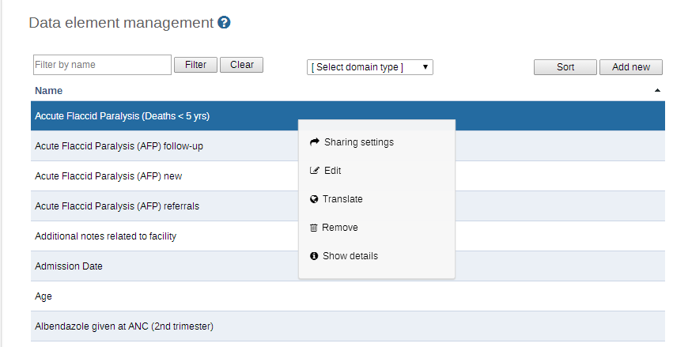
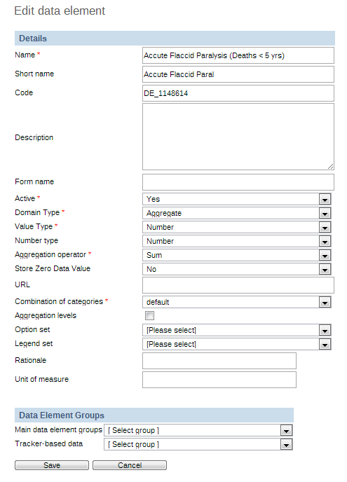
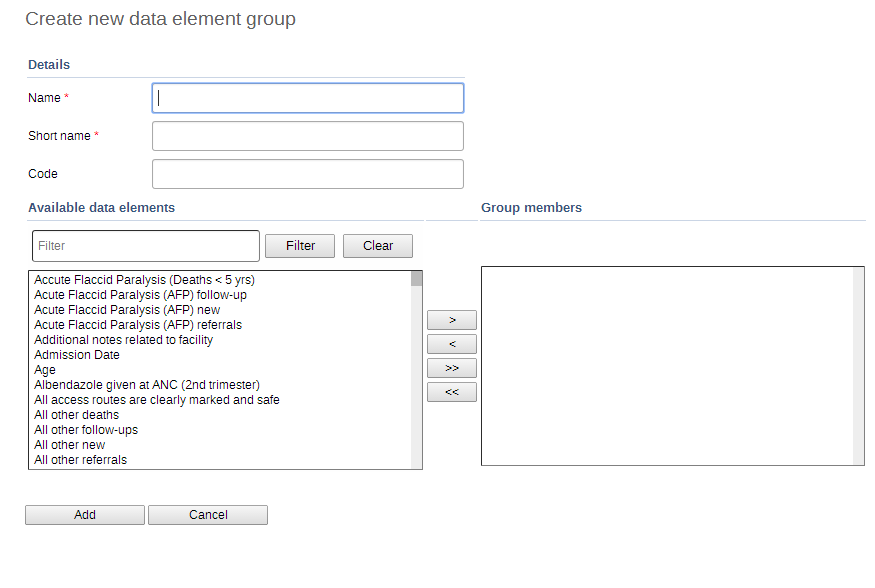
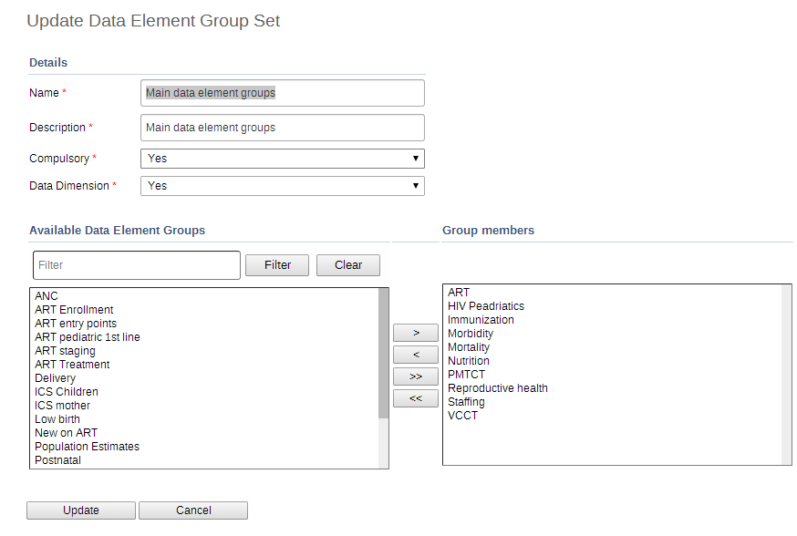

.. index:: Events Data Elements

When the Data Elements and Indicators options is chosen from the main Maintenance menu, the following screen appears:

.. _data_elements:
.. figure::  images/dataelements.png
   :align:   center

From the left side menu or by clicking on the sections listed in the central area you can access the various sections on data elements and indicators.

Each of the options for maintenance of data elements will be described in the following section.

* Data element

* Create, modify, view and delete data elements.

* Data element group

* Create, modify, view and delete data element groups.

* Data element group editor

* Easily add or remove data elements to and from data element groups.

* Data element group set editor

* Create, modify, view and delete data elements group sets.

* Data element category options, categories and category combinations

* Create, modify, view and delete data element categories.

Data elements
=============
Data elements form the basis of iROAD2. Data elements define what is actually recorded in system, e.g. number of immunisations or number of cases of malaria. The actual creation and definition of the data elements themselves are far beyond the scope of this manual to describe, but it is assumed that an administrator will be provided with a list of standardised data elements for inclusion into the iROAD2 system.

To access the data element maintenance module, choose Maintenance -> Data elements and Indicators -> Data element.

The 'Filter by name' will allow you to filter a range of data elements if you know either the full name of the data element, or just a part of it. Type the name into the search field and any matching data elements are displayed below. The 'Sort' button can be used to sort the data elements into alphabetical order.

.. _data_elements2:

To add a new data element, click the 'Add new' button. There are various options available from this page that allow the user to modify data elements already present in the database. Each of the options are described below in the "Editing data elements".

Editing data elements
---------------------
To edit an existing data element, click the name of data element you wish to modify, and then select "Edit" from the context menu which will appear.

.. _data_element_edit:

* Name: Define the precise name of the data element in this field. Each data element must have a unique name.

* Short name: Typically, an abbreviation of the full data element name. This attribute is often used in reports to display the name of the data element, where there is limited space available.

* Code: In many countries, data elements are assigned a code. This code can be entered in this field.

* Description: Allows a full textual description of the data element to be entered. The user should be as precise as possible, and include full information on how the data element is measured and what its meaning is.

* Active: Defines whether a given data element is active or not. Data elements marked as inactive, will not be displayed in the data entry screens.

* Domain type: Defines whether a data element is an aggregate or patient type of data element.

* Value type: Defines the type of data this data element will be used to record. Currently there are five options:

#.  Number: Numeric values.

#. Text: Textual values. The maximum number of characters which are allowed by the system is 60,000.

#. Yes/No: Boolean values, will render as drop-down lists in data entry.

#. Yes only: True values, will render as check-boxes in data entry.

#. Date: Dates, will render as calendar widget in data entry.

#. User name: This will be populated with the username of the user which performs data entry automatically during the data entry process.

#. Number type: iROAD 2 supports several different number types. During data entry, users will be restricted to enter the defined number types only. Each of the available options are described below.

* Number: This number type supports any real value with a single decimal point, an optional negative sign, and no thousands separators.

#. Integer: Any whole number (positive and negative), including zero.

#. Positive integer: Any whole number greater than (but not including) zero.

#. Negative integer: Any whole number less than (but not including) zero.

#. Positive or zero integer: Any whole number greater than or equal to zero.

#. Unit interval: Continuous number between 0 and 1.

#. Percentage: Whole number inclusive between 0 and 100.

* Text type: The detailed type relevant to text value type.

#. Text: Free text, rendered as standard input field.

#. Long text: Free text, rendered as text area in data entry.

* Aggregation operator: Defines the default aggregation operation that will be used on this data element. Most data elements should have the "SUM" option set. This includes all data elements which should be added together. Other data elements, such as staffing levels, should be set to use the "AVERAGE" operator, when values along the time dimension should not be added together, but rather averaged. The complete list of aggregation operators:

#. Sum: Sum of data values in the period and organisation unit dimension

#. Average (sum in orgunit hierarchy): Average of data values in the period dimension, sum in the organisation unit dimensions.

#. Average: Average the values in both the period as well as the orgunit dimensions.

#. Count: Count of data values.

#. Standard deviation: Standard deviation (population-based) of data values.

#. Variance: Variance (population-based) of data values.

#. Min: Minimum of data values.

#. Max: Maximum of data values.

* Store Zero Data Value: By default, iROAD2 will not store zeros which are entered in the data entry module. If zeros need to be saved for a particular reason, this option can be set to "Yes".

* URL: A URL having an in-depth description of the data element can be entered in the URL field. This could be for instance, a link to a metadata repository or registry that contains detailed technical information about the definition and measurement of the data element.

* Category Combination: Defines which category combination the data element should have, also known as the "disaggregation".

* Aggregation levels: The Aggregation Levels option allows the data element to be aggregated at one or more levels. When the user clicks on the Aggregation levels option, a drop down menu appears which displays available aggregation levels. The desired aggregation level is then selected by clicking the "Add Selecte" button. By default, the aggregation will start at the lowest assigned organisation unit. If e.g. Chiefdom is selected below it means that Chiefdom, District, and National aggregates will use Chiefdom (the highest aggregation level available) as the data source, and PHU data will not be included. PHU data will still be available for the PHU level, but not included in aggregations to the levels above. If District and Chiefdom are both selected then the District and National level aggregates will use District data as their source, Chiefdom will use Chiefdom, and PHU will use PHU. Read more about aggregation levels in the Reporting chapter i the section on data sources for reporting.

* Option set for data values: Option sets are predefined lists of options which can be used in data entry.

* Option set for comments: Option sets for comments are predefined list of options which can be used to specify standardized comments for data values in data entry.

* Legend set: Legend sets can be used in the GIS module to display certain data elements with certain icons. Refer to the GIS module documentation for more information on legend sets.

* Attributes: Data element attributes (if they have been defined) can be defined. In this example, "Rationale" and "Unit of measure" are both data element attributes.

* Data element group sets: If data element group sets have been defined, each will appear in the "Data element groups" section. Select each data element group from the list of group sets provided.

After making all the required changes, click "Save". The "Cancel" button aborts all changes made.

Deleting a data element
^^^^^^^^^^^^^^^^^^^^^^^
In order to delete a data element, click the name of the data element you wish to delete, and then select "Remove" from the context menu. Note that this operation is only possible if there is no data attached to the data element itself. The user will be prompted to ensure that the data element should be deleted.

Displaying data element details
^^^^^^^^^^^^^^^^^^^^^^^^^^^^^^^
This operation displays an in-line panel in the browser which displays all metadata about a given data element. Click the name of the data element and then select "Show details" from the context menu.

Data element groups
===================
Data element groups provide a mechanism for classifying related data elements into a common theme. For instance, two data elements "Measles immunisation" and "BCG Immunisation" might be grouped together into a data element group "Childhood immunisation". To access the data element group maintenance page, click Maintenance -> Data elements and Indicators -> Data Element Group.

Similar to the "Data element" maintenance page, data elements groups can be searched with by entering a search string in the "Filter by name" field.

To add a new data element group, click the "Add new" button and the following screen will be displayed:

.. _data_group:

Fill in the "Name" field and then select all data elements that should belong to the group from the left panel. Click the "Move selected" button to add the selected data elements to the data element group. Click the "Remove selected" button to remove all data elements from the group that have been selected in the right panel. Finally, click the "Add" button to save changes, or the "Cancel" button to discard any changes.

Data element group editor
=========================
The data element group editor provides advanced functionality to the administrator to allow multiple data elements to be added or removed from a group. It is also possible to create new data element groups, rename existing groups, and delete groups entirely. To access the data element group editor, go to "Maintenance -> Data elements and Indicators -> Data Element Group Editor". The following screen will appear.

Data element groups area listed alphabetically in the leftmost panel. By clicking on a data element group, the current members of that group (data elements) are listed in the centre panel. Available data elements that can be added to the data element group appear are listed alphabetically in the rightmost panel. To remove an existing data element from the group, click the name of the data element in the centre panel, and then press the "Move right"   button. To add data elements to the group, select them from the leftmost panel, and click the "Move left"  button. Press the "Update data element group member" button to save your changes.

Data element group sets
=======================
Data element group sets allow multiple data element groups to be categorised into a set. Data element group sets are used during analysis and reporting to combine similar data element groups into a common theme. To access the data element group set maintenance module, choose "Maintenance -> Data elements and Indicators -> Data Element Group Set". Similar to the other data element maintenance modules, new data element group sets can be added by pressing the "Add new button". Other operations include Edit, Translate, Delete and Information, similar to data elements and data element groups as described in the previous sections.

Existing data element group set members can be edited by clicking the name and selecting "Edit" from the context menu of the desired data element group set as seen below.

.. _data_group_sets:

   
Available data element groups are displayed in the left panel. They can be moved into the selected data element group set by pressing the "Move right"  button. Data element groups that are currently members of the data element group set are displayed in the right hand panel. They can be removed from the data element group set by clicking the desired data element group and pressing the "Move left" button. The ordering of the data element groups can be set with the "Move Up"  and "Move Down" arrows. This ordering will be used in the datamart and reports to order the data element groups. Press the "Update" button to save any changes and the "Cancel" button to discard all changes.

