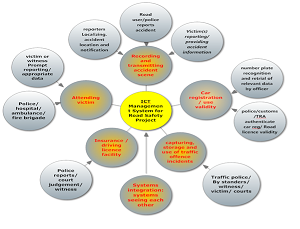

.. index:: Data Managemement

***************
Data Management
***************

(content)
.. index:: Data Entry

Data entry
==========

(content)

.. _fields_image:

.. centered:: **fig 3.1: Image showing the Interface of a Data entry form loading data.**

(Another content)

An example of the form ready for data entry is as follows:

.. _fields_image:

.. centered:: **fig 3.3: Image Showing Data entry Form .**

(Another Content)

.. _fields_image:

.. centered:: **fig 3.4: The red covered Fields are the Compulsory ones.**

.. index:: Update Records

Update Records
==============

(Another content on updating records)

.. _fields_image:

.. centered:: **fig 3.5: Update records Loading Data.**

(Another content)

.. _fields_image:

.. centered:: **fig 3.7: An example of records .**

(Another content)

.. index:: Edit Records

Edit Records
------------

.. _fields_image:

.. centered:: **fig 3.7: An example of records .**

(Content on edit Records)

.. index:: History Management

History Management
------------------

(Content on history management)

.. _fields_image:

.. centered:: **fig 3.8: Image showing History Details.**

(Content on history management)

.. _fields_image:

.. centered:: **fig 3.9: Image showing an Interface for adding History to a record.**

(Content on history management)

.. _fields_image:

.. centered:: **fig 3.10:  Image showing an interface of History Details of an employee record.**

(Content on history management)

.. index:: Data Validation

Data Validation
===============

(Content on Data Validation)

.. _fields_image:

.. centered:: **fig 3.14:  Image showing an interface for running Data Validation.**
 

 
