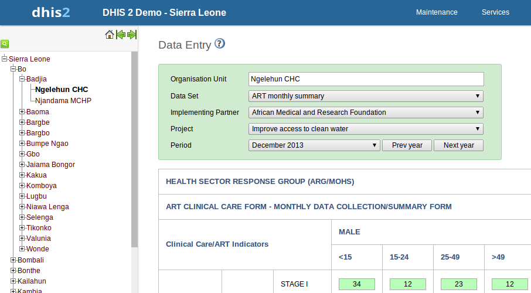

..index:: Data Sets

Data sets
==========
All data entry in iROAD2 is organised through the use of data sets. You can add and edit data sets in Maintenance->Data sets. A data set is a collection of data elements grouped together for data collection and data export between instances of iROAD2 (e.g. from a district office local installation to a national server).

A data set has a data collection frequency which can be set through the period type property. The frequency can be daily, weekly, monthly, quarterly, six-monthly, or yearly. Which data elements to include in the data set and the frequency are set in the Add/Edit Data set window. In order to use a data set to collect data for a specific orgunit you must assign the orgunit to the data set, and this mechanism controls which org units that can use which data sets.

Data sets also are assigned to specific organisation units which will be allowed to enter data for all data elements in that data set. You can assign org units to a data set in the Data set management by clicking on the blue folder icon, the first icon under Operations, next to the data set you would like to modify. Alternatively you can manage orgunit assignments for all data sets together in the Data set Assignment Editor (available in the right-side menu).

A data set has several properties that must be entered when creating a new one. Name, short name, code and description should be used to identify and describe the data set. The other properties deserve an explanation:

* Expiry days: Controls for how long it should be possible to enter data in data entry for this data set. Expiry days refer to the number of days after the end date of the selected data entry period where the data entry form should be open for entry. After the number of days has expired, the data set will be locked for further entry. You can set manual exceptions to this using the lock exception functionality in data administration module.

[Note]	Note::
If the number of expiry days is set to zero, this will allow data entry into all possible historical time periods.

* Complete notification recipients: Sets which users should receive a message with a notification about this data set being marked as complete in data entry. In this list you can select a user group, and all members in this group will receive a notification. The message will be delivered through the iROAD messaging system.

* Approve data: Define whether data for this data set should be Approved. (See the Data approval chapter.)

* Skip aggregation: Define whether data for this data set should be skipped during data mart generation. You should leave this on no, which is the default behavior, in most situations. Can be useful if you have limited server resources and are setting up new experimental data sets.

* Allow future periods: Defines whether it should be possible to enter data for future periods for this data set in data entry. The default behavior is to allow data entry only for periods which have passed, i.e. the end date is after today's date. If set to yes you can enter data for future periods, which is useful e.g. for population, target and planning data.'

* All fields for data elements required: Defines whether it is mandatory to fill all values for a data element in data entry if one or more values have been filled. This means that if the user enters one data value for a data element in an entry field (i.e. for a category option combination), then she must enter data for all fields belonging to that data element (i.e. all category option combinations).

* Complete allowed only if validation passes: Controls whether it should be possible to mark a data entry form as complete only if the validation of that form is successful. Default behavior is yes. If set to no, then a user cannot mark the form complete if validation fails.

* Skip Offline: Controls whether this data entry form should be downloaded and saved in the user's web browser. Normally you should leave this on no, which is the default behavior. If you have forms which are rarely used and are very big you can consider setting it to yes to speed up initial loading of the data entry module.

Your data set will then be ready to be used in Services->Data Entry for the org units that you have assigned and for periods according to your selected frequency (period type).

Data set categories
-------------------
Before reading this section it is recommended to familiarize oneself with the sections on categories in the data element chapter. Whereas data element categories can be used for capturing disaggregations of data elements, data set categories are used to capture information which is common to an entire form.

To set up categories for data set, start by creating category options, categories and category combinations like described in the data element chapter. Make sure that you set the type of categories and category combinations to "Attribute". To assign a category combination to a data set, you can select it while creating or updating the data set from the "Combination of categories" drop-down box.

When a data set is linked to a category combination, those categories will be displayed as drop-down boxes in the data entry module. Data captured in the form will then be linked to the selected category options from those drop-down boxes.

An scenario for when data set categories are useful is when you need to capture a data entry form for a implementer partner organisation and a project. In that case, start by creating category options and categories for all partner organisations and projects, before linking these in a new category combination. Then, link the category combination to the data set (form) for which you need to capture this information. When opening this data set in data entry module, the partner organisation and project categories will automatically be rendered as drop-down boxes, allowing you to select a specific implementing partner organisation and project before continuing to do data entry.

.. _dataset-categories:

   
Data Entry Forms
================
Once you have assigned a data set to an orgunit that data set will be made available in Data Entry for the orgunits you have assigned it to. A default data entry form will then be shown, which is simply a list of the data elements belonging to the data set together with a column for inputting the values. If your data set contains data elements with a non-default categorycombination, such as age groups or gender then additional columns will be automatically generated in the default form based on the different options/dimensions.

If you use more than one dataelement category combination you will get multiple columns in the data entry form with different column headings for the options. In addition to the default list-based data entry form there are two more alternatives, the section-based form and the custom form.

Section forms
-------------
Section forms allow for a bit more flexibility when it comes to using tabular forms and are quick and simple to design. Often your data entry form will need multiple tables with subheadings, and sometimes you need to disable (grey out) a few fields in the table, both of these functions are supported in section forms. This function can be access by choosing Maintenance->Data set Section.

Adding a new section form
-------------------------
Section forms are separated automatically by data element category combinations, which produce a spreadsheet like data entry form for each section.

When designing a section form the procedure is as follows:

#. Set up your data set as described in Section 6.1, Data sets

#. Open the Data Set Section window (from right side menu under Data sets) and add your sections one by one. To add a new section to a section form, first choose the data set from the "Select data set" combo box. Then choose the specific category combo and press "Add new". You can now add data elements from the "Available data element" list on the left to the "Selected data elements" list on the right. Data elements can be sorted within the section with the use of the "Move up"  and "Move down"  buttons. Be sure to press "Save" once you have finished.

[Note]	Note::
You can only use one data element category combination per section.

#. You may need to control how the data element sections are displayed on the final form. In Data set Section management, select the data set from the "Data set" drop-down box, then leave [All] in the "Select Category Combo" drop-down. Click on "Sort section" to sort the order of appearance of your sections in the data entry form.

#. In Data Entry you can now start using the Section form (should appear automatically when sections are available for the selected data set). Data sets which have section forms will automatically display the section form.

#. Certain data elements may need to be disabled for data entry. Clicking on the "Section grey field management" menu item will allow you to disable specific data element category options as seen below. Pressing the "Disable" button will prevent data from being entered into this specific data element/category option during data entry. Be sure to press "Done" to save your changes.

