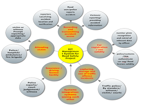

.. getstarted:

.. index:: Getting started with iROAD 2

Getting started with iROAD 2 
=============================

After reading this chapter you will be able to understand:

* Start iROAD 2 from the desktop

* How to log-in from the desktop

* Create new users and user roles

* What steps are needed to design a iROAD 2 database for your organisationThe iROAD documentation is a collective effort and has been developed by the development team and users. While the guide strives to be complete, there may be certain functionalities which have been omitted or which have yet to be documented. This section explains some of the conventions which are used throughout the document.

Prerequisites
-------------

You must be sure that you have a current version of the Java Runtime installed on your machine. Depending on your operating system, there are different ways of installing Java. The reader is referred to this website for detailed information on getting Java installed.

Installing iROAD
----------------

**PHP5-INTL Dependency**

    On Systems running Linux Operating systems run::

      sudo apt-get install php5-intl

    On Systems running Mac OSX Operating systems run::

      brew install icu4c

    **Download system source codes from our** `github repository <https://github.com/MorleyMinde/rsmsa>`_ - https://github.com/MorleyMinde/rsmsa::

        https://github.com/MorleyMinde/rsmsa.git
        
    Install composer inside project directory - hris Note: hris now comes with composer pre-installed::

        curl -s https://getcomposer.org/installer | php

    .. note:: 

       If you don't have curl, install composer with this script php -r "eval('?>'.file_get_contents('https://getcomposer.org/installer'));"

    Update your repository with latest dependecies::

        php composer.phar install

        php composer.phar update

    Symbolic Link your web directory to the webroot directory::

        ln -s ${PWD}/web/ /var/www/rsmsa     #Assuming your current directory(PWD) is inside hris project and your webroot is on /var/www/

    Set date time zone inside php.ini to your location,change line date.timezone to your locale, e.g in `Dar-es-salaam, Tanzania`::

        date.timezone = 'Africa/Dar_es_Salaam'

    Turn off short_open_tag inside php.ini to disable detection of PHP codes between <? and ?> for better PHP >=5.3 Experience::

        short_open_tag = Off

    Give Web readwrite access to cache and log directory in your hris directory. To enjoy both user and web read-write access in linux use the following commands::

        rm -rf app/cache/*

        rm -rf app/logs/*

    On Systems supporting chmod +a(e.g. Mac), you can give readwrite permission via::

        sudo chmod +a "www-data allow delete,write,append,file_inherit,directory_inherit" app/cache app/logs

        sudo chmod +a "`whoami` allow delete,write,append,file_inherit,directory_inherit" app/cache app/logs

    On Systems that don't support chmod +a(e.g. Linux), you can give readwrite permission via::

        sudo setfacl -R -m u:www-data:rwx -m u:`whoami`:rwx app/cache app/logs

        sudo setfacl -dR -m u:www-data:rwx -m u:`whoami`:rwx app/cache app/logs
        
Database Setup
--------------

`System source code can be downloaded from github <https://github.com/MorleyMinde/rsmsa>`_

    Configuration file can be found from rsmsa/app/config/database.php

**database.php**::

  		'mysql' => array(
			'driver'    => 'mysql',
			'host'      => 'localhost',
			'database'  => 'rsmsa',
			'username'  => 'root',
			'password'  => '',
			'charset'   => 'utf8',
			'collation' => 'utf8_unicode_ci',
			'prefix'    => '',
		),

**To generating database,go to the command prompt and run the  following commands.**::
    
	
        php artisan migrate                             #Creates Fresh new database
        php artisan db:seed                             #seeds startup data to the database

**Creating, Activating,Changing password, deactivate, demote & promote login-user from commandline**::

        app/console fos:user:create                     #Create User account
        app/console fos:user:activate                   #Activate a user
        app/console fos:user:change-password            #Change the password of a user.
        app/console fos:user:create                     #Create a user.
        app/console fos:user:deactivate                 #Deactivate a user
        app/console fos:user:demote                     #Demote a user by removing a role
        app/console fos:user:promote                    #Promotes a user by adding a role

**Regenerating assets**::

        app/console assetic:dump
        php app/console assets:install web

**Shell Console**::

        app/console --shell
        

.. index:: Description of the System

Description of the System
=========================

This part is intended to give user an insight on how to use the system and access different features and system components.

Logging on to iROAD 2
---------------------

Open the browser and type the following address: http://www.roadsafety.udsm.go.tz then a page similar to the one shown in the image below will be displayed whereby a user will be required to type in their correct username and password. In the instance where one does not have a username or password please see register information following next. This system works best with Mozilla Firefox, Google Chrome or Opera browsers. From here on, the use of the word browser will refer to above mentioned web browsers only.Open the browser and type the following address:  then a page similar to the one shown in the image below will be displayed whereby a user will be required to type in their correct username and password. In the instance where one does not have a username or password please see register information following next. This system works best with Mozilla Firefox, Google Chrome or Opera browsers. From here on, the use of the word browser will refer to above mentioned web browsers only.

.. _fields_image:
.. figure::  images/login.png
   :align:   center

.. centered:: **fig 1.1: Image showing login Interface.**

Upon successful login, a user will be directed to the page with the menu on the left hand side through which he can access various parts of the system (see figure 1.3 below). However on unsuccessful login an error message will be displayed (see figure 1.2 below) and you will be required to re-type the username and password.

.. _fields_login1:
.. figure::  images/login2.png
   :align:   center

.. centered:: **fig 1.2: Image showing error message displayed on unsuccessful login.**

.. _fields_login2:
.. figure::  images/login2.png
   :align:   center

.. centered:: **fig 1.3: Image showing iROAD home page on successful Login.**
 

Registering on to iROAD 2
^^^^^^^^^^^^^^^^^^^^^^^^^

In the case where one does not have a username or password, they will be required to first register themselves in order to have an account in the system. To do so; besides the login page, there is a register tab. On selecting it, a page similar to one shown below (Figure 1.4 below) will appear requesting the new user to fill in all required details and submit them by clicking the Register button. After doing so an email to activate the account will be sent to the users email account provided during registration; and the registering user will be prompted to visit their email and follow link sent for activating their account. 
These steps so far, will enable for an account to be created but access to information already in the system will still not be possible until verification of user is done by the help desk team who will then assign new user to an organization unit for complete registration.

.. _fields_register:

.. centered:: **fig 2.1: Image showing Register Page for new user.**

User profile
^^^^^^^^^^^^

User profile enables a user to view their profile, customize dashboard reports, view settings, change user password or log out of the system. To access the user profile click on the username and a drop down list as seen in the diagram will appear.

.. _fields_profile:
.. figure::  images/profile.png
   :align:   center

.. centered:: **fig 4.3: Image showing User Profile options.**

Change password
^^^^^^^^^^^^^^^

In the instance where a user wants to change his/her password, the Change Password? link on the login page is there to assistance. On clicking the link a user will be sent to a page as shown in the Figure 3.1 and required to provide the current password and the new password.After that the user shoul click on the "SUBMIT" button and he/she will have a new password.

.. _password_image:
.. figure::  images/changepassword.png
   :align:   center

.. centered:: **fig 3.1: Image showing required details for changing password.**

Home page
^^^^^^^^^

On successful login, a user is directed to the Home Page which consists of the main menu on the right side and dashboard charts in the middle. 

.. _home_image:
.. figure::  images/login2.png
   :align:   center

.. centered:: **fig 4.1: User Home Page displaying interactive components.**

Services
^^^^^^^^

On the Home page there is a link on the right hand side written "Services" that will direct you to the services the system offers.Figure below shows the services page.

.. _services_image:
.. figure::  images/services.png
   :align:   center

.. centered:: **fig 4.1: User Home Page displaying interactive components.**

Quick intro to designing a iROAD 2 database
-------------------------------------------
The iROAD 2 application comes with a set of tools for data collection, validation, reporting and analysis, but the contents of the database, e.g. what to collect, who should collect it and on what format will depend on the context of use. This metadata need to be populated into the application before it can be used, and this can be done through the user interface and requires no programming or in-depth technical skills of the software. We call this initial process database design or customisation.

This section will provide a very quick and brief introduction to iROAD 2 database design and mainly explain the various steps needed to prepare a new iROAD 2 system for use. How to do each step is explained in other chapters, and best practices on design choices will be explained in an implementers manual (expected during first half of 2011). Here are the steps to follow:

* Set up an organisational hierarchy

* Define data elements

* Define data sets and data entry forms

* Define validation rules

* Define indicators

* Define report tables and design reports

* Set up the GIS module

* Design charts and customise the dashboard

The organisational hierarchy
^^^^^^^^^^^^^^^^^^^^^^^^^^^^
The organisational hierarchy defines the organisation using the iROAD 2, the health facilities, administrative areas and other geographical areas used in data collection and data analysis. This dimension to the data is defined as a hierarchy with one root unit (e.g. Ministry of Health) and any number of levels and nodes below. Each node in this hierarchy is called an organisational unit in iROAD 2.

The design of this hierarchy will determine the geographical units of analysis available to the users as data is collected and aggregated in this structure. There can only be one organisational hierarchy at the same time so its structure needs careful consideration. Additional hierarchies (e.g. parallel administrative groupings such as "Facility ownership") can be modelled using organisational groups and group sets, however the organisational hierarchy is the main vehicle for data aggregation on the geographical dimension. Typically national organisational hierarchies in public health have 4-6 levels, but any number of levels is supported. The hierarchy is built up of parent-child relations, e.g. a Country or MoH unit (the root) might have e.g. 8 parent units (provinces), and each province again ( at level 2) might have 10-15 districts as their children. Normally the health facilities will be located at the lowest level, but they can also be located at higher levels, e.g. national or provincial hospitals, so skewed organisational trees are supported (e.g. a leaf node can be positioned at level 2 while most other leaf nodes are at level 5).

Typically there is a geographical hierarchy defined by the health system. e.g. where the administrative offices are located (e.g. MoH, province, district), but often there are other administrative boundaries in the country that might or might not be added, depending on how its boundaries will improve data analysis. When designing the hierarchy the number of children for any organisational unit may indicate the usefulness of the structure, e.g. having one or more 1-1 relationships between two levels is not very useful as the values will be the same for the child and the parent level. On the other extreme a very high number of children in the middle of the hierarchy (e.g. 50 districts in a province) might call for an extra level to be added in between to increase the usefulness of data analysis. The lowest level, the health facilities will often have a large number of children (10-60), but for other levels higher up in the hierarchy approx. 5-20 children is recommended. Too few or too many children might indicate that a level should be removed or added.

Note that it is quite easy to make changes to the upper levels of the hierarchy at a later stage, the only problem is changing organisational units that collect data (the leaf nodes), e.g. splitting or merging health facilities. Aggregation up the hierarchy is done based on the current hierarchy at any time and will always reflect the most recent changes to the organisational structure. Refer to the chapter on Organisation Units to learn how to create organisational units and to build up the hierarchy.

Data Elements
^^^^^^^^^^^^^
The Data Element is perhaps the most important building block of a iROAD 2 database. It represents the "WHAT" dimension, it explains what is being collected or analysed. In some contexts this is referred to an indicator, but in iROAD 2 we call this unit of collection and analysis a data element. The data element often represents a count of something, and its name describes what is being counted, e.g. "BCG doses given" or "Malaria cases". When data is collected, validated, analysed, reported or presented it is the data elements or expressions built upon data elements that describes the WHAT of the data. As such the data elements become important for all aspects of the system and they decide not only how data is collected, but more importantly how the data values are represented in the database, which again decides how data can be analysed and presented.

It is possible to add more details to this "WHAT" dimension through the disaggregation dimension called data element categories. Some common categories are Age and Gender, but any category can be added by the user and linked to specific data elements. The combination of a data element's name and its assigned category defines the smallest unit of collection and analysis available in the system, and hence describes the raw data in the database. Aggregations can be done when zooming out of this dimension, but no further drill-down is possible, so designing data elements and categories define the detail of the analysis available to the system (on the WHAT dimension). Changes to data elements and categories at a later stage in the process might be complicated as these will change the meaning of the data values already captured in the database (if any). So this step is one of the more decisive and careful steps in the database design process.

One best practice when designing data elements is to think of data elements as a unit of data analysis and not just as a field in the data collection form. Each data element lives on its own in the database, completely detached from the collection form, and reports and other outputs are based on data elements and expressions/formulas composed of data elements and not the data collection forms. So the data analysis needs should drive the process, and not the look an feel of the data collection forms. A simple rule of thumb is that the name of the data element must be able to stand on its own and describe the data value also outside the context of its collection form. E.g. a data element name like "Total referrals" makes sense when looking at it in either the "RCH" form or the "OPD" form, but on its own it does not uniquely describe the phenomena (who are being referred?), and should in stead be called "Total referrals from Maternity" or "Total referrals from OPD". Two different data elements with different meanings, although the field on the paper form might only say "Total referrals" since the user of the form will always know where these referrals come from. In a database or a repository of data elements this context is no longer valid and therefore the names of the data elements become so important in describing the data.

Common properties of data elements can be modelled through what is called data element groups. The groups are completely flexible in the sense that they are defined by the user, both their names and their memberships. Groups are useful both for browsing and presenting related data, but can also be used to aggregate data elements together. Groups are loosely coupled to data elements and not tied directly to the data values which means they can be modified and added at any point in time without interfering with the raw data.

Datasets and data entry forms
^^^^^^^^^^^^^^^^^^^^^^^^^^^^^
All data entry in iROAD 2 is organised through the use of Datasets. A Dataset is a collection of data elements grouped together for data collection, and in the case of distributed installs they also define chunks of data for export and import between instances of iROAD 2 (e.g. from a district office local installation to a national server). Datasets are not linked directly to the data values, only through their data elements and frequencies, and as such a dataset can be modified, deleted or added at any point in time without affecting the raw data already captured in the system, but such changes will of course affect how new data will be collected.

A dataset has a period type which controls the data collection frequency, which can be daily, weekly, monthly, quarterly, six-monthly, or yearly. Both which data elements to include in the dataset and the period type is defined by the user, together with a name, short name, and code.

In order to use a dataset to collect data for a specific orgunit you must assign the orgunit to the dataset, and this mechanism controls which orgunits that can use which datasets, and at the same time defines the target values for data completeness (e.g. how many health facilities in a district expected to submit RCH data every month).

A data element can belong to multiple datasets, but this requires careful thinking as it may lead to overlapping and inconstant data being collected if e.g. the datasets are given different frequencies and are used by the same orgunits.

Data entry forms
^^^^^^^^^^^^^^^^
Once you have assigned a dataset to an orgunit that dataset will be made available in Data Entry (under Services) for the orgunits you have assigned it to and for the valid periods according to the dataset's period type. A default data entry form will then be shown, which is simply a list of the data elements belonging to the dataset together with a column for inputting the values. If your dataset contains data elements with categories such as age groups or gender, then additional columns will be automatically generated in the default form based on the categories. In addition to the default list-based data entry form there are two more alternatives, the section-based form and the custom form.

Section forms
"""""""""""""
Section forms allow for a bit more flexibility when it comes to using tabular forms and are quick and simple to design. Often your data entry form will need multiple tables with subheadings, and sometimes you need to disable (grey out) a few fields in the table (e.g. some categories do not apply to all data elements), both of these functions are supported in section forms. After defining a dataset you can define it's sections with subsets of dataelements, a heading and possible grey fields i the section's table. The order of sections in a dataset can also be defined. In Data Entry you can now start using the Section form (should appear automatically when sections are available for the selected dataset). You can switch between default and section forms in the top right corner of the data entry screen. Most tabular data entry forms should be possible to do with sections forms, and the more you can utilise the section forms (or default forms) the easier it is for you. If these two types of forms are not meeting your requirements then the third option is the completely flexible, although more time-consuming, custom data entry forms.

Custom Forms
""""""""""""
When the form you want to design is too complicated for the default or section forms then your last option is to use a custom form. This takes more time, but gives you full flexibility in term of the design. In iROAD 2 there is a built in HTML editor (FcK Editor) for the form designer and you can either design the form in the UI or paste in your html directly (using the Source window in the editor. In the custom form you can insert static text or data fields (linked to data elements + category) in any position on the form and you have complete freedom to design the layout of the form. Once a custom form has been added to a dataset it will be available in data entry and used automatically. You can switch back to default and section (if exists) forms in the top right corner of the data entry screen.

Validation rules
^^^^^^^^^^^^^^^^
Once you have set up the data entry part of the system and started to collect data then there is time to define data quality checks that help to improve the quality of the data being collected. You can add as many validation rules as you like and these are composed of left and right side expressions that again are composed of data elements, with an operator between the two sides. Typical rules are comparing subtotals to totals of something. E.g. if you have two data elements "HIV tests taken" and "HIV test result positive" then you know that in the same form (for the same period and organisational unit) the total number of tests must always be equal or higher than the number of positive tests. These rules should be absolute rules meaning that they are mathematically correct and not just assumptions or "most of the time correct". The rules can be run in data entry, after filling each form, or as a more batch like process on multiple forms at the same time, e.g. for all facilities for the previous reporting month. The results of the tests will list all violations and the detailed values for each side of the expression where the violation occurred to make it easy to go back to data entry and correct the values.

Indicators
^^^^^^^^^^
Indicators represent perhaps the most powerful data analysis feature of the iROAD 2. While data elements represent the raw data (counts) being collected the indicators represent formulas providing coverage rates, incidence rates, ratios and other formula-based units of analysis. An indicator is made up of a factor (e.g. 1, 100, 100, 100 000), a numerator and a denominator, the two latter are both expressions based on one or more data elements. E.g. the indicator "BCG coverage <1 year" is defined a formula with a factor 100, a numerator ("BCG doses given to children under 1 year") and a denominator ("Target population under 1 year"). The indicator "DPT1 to DPT3 drop out rate" is a formula of 100 % x ("DPT1 doses given"- "DPT3 doses given") / ("DPT1 doses given").

Most report modules in iROAD 2 support both data elements and indicators and you can also combine these in custom reports, but the important difference and strength of indicators versus raw data (data element's data values) is the ability to compare data across different geographical areas (e.g. highly populated vs rural areas) as the target population can be used in the denominator.

Indicators can be added, modified and deleted at any point in time without interfering with the data values in the database.

Report tables and reports
^^^^^^^^^^^^^^^^^^^^^^^^^
Standard reports in iROAD 2 is a very flexible way of presenting the data that has been collected. Data can be aggregated by any organisational unit or orgunit level, by data element, by indicators, as well as over time (e.g. monthly, quarterly, yearly). The report tables are custom data sources for the standard reports and can be flexibly defined in the user interface and later accessed in external report designers such as iReport or BIRT. These report designs can then be set up as easily accessible one-click reports with parameters so that the users can run the same reports e.g. every month when new data is entered, and also be relevant to users at all levels as the organisational unit can be selected at the time of running the report.

GIS
^^^
In the integrated GIS module you can easily display your data on maps, both on polygons (areas) and as points (health facilities), and either as data elements or indicators. By providing the coordinates of your organisational units to the system you can quickly get up to speed with this module. See the GIS section for details on how to get started.

Charts and dashboard
^^^^^^^^^^^^^^^^^^^^
On of the easiest way to display your indicator data is through charts. An easy to use chart dialogue will guide you through the creation of various types of charts with data on indicators, organisational units and periods of your choice. These charts can easily be added to one of the four chart sections on your dashboard and there be made easily available right after log in. Make sure to set the dashboard module as the start module in user settings.