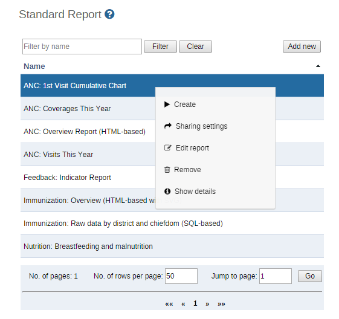
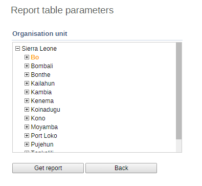
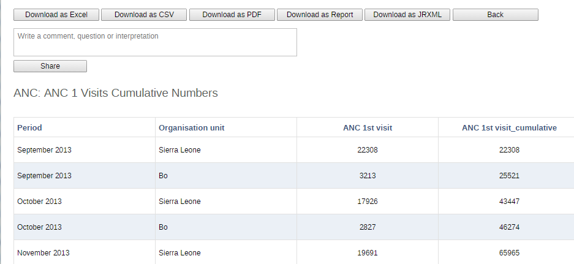

..index:: Using reporting functionality

Using reporting functionality
=============================

14.1. Reporting functionality in iROAD 2
The reporting module in iROAD 2 provides a range of reporting alternatives, and this section will explain how to use them to view and analyse data. Another section explains how to configure and set up the various reporting tools.

Standard reports: Standard reports are built on report tables, but are more advanced in its design allowing for more cosmetics and styles. These reports can also combine multiple tables and charts in the same report and be made available as one-click reports that are very easy to use. These reports can be downloaded as PDF files which makes them ideal for printing as well as sharing offline.

Dataset reports: Dataset reports are simply a printer friendly way to look at the data entry forms with either raw or aggregated data (over time or place). The design used in data entry will be used also in the data set reports. This will work only for data sets that has a custom data entry form set up.

Dashboard: The fastest way to view your data. The dashboard can display up to four updated charts as well as shortcuts to your favourite reports, report tables, and map views. Each user can configure a personal dashboard.

Data Visualizer: Do flexible visualizations of your data as charts and data tables. Any number of indicators and data elements can be included. Several chart types are available, such as column, stacked column, line, area and pie charts. The charts can be saved in order to be easily retrieved later and can also be put on your personal dashboard. Charts can be downloaded as image and PDF files to your local computer.

Report tables: These are very configurable table outputs of your data, either showing raw or aggregated data, as well as indicator data. These tables are used as either a data source for more advanced reports, for export to external systems, or as a crude report itself, and are exportable to PDF, excel, CSV and jasper design files. These tables represent a very dynamic, flexible and quick way to look at the data. Report tables can be set up with parameters to make them reusable over time and place.

Orgunit distribution reports: These reports are generated off the orgunit group set information and can show what types (and how many of each type) of health facilities that are located in a given area (any level in the hierarchy). These reports are automatically generated and display the information in both tables and charts, and downloads in PDF, excel, and CSV are available.

Reporting rate summary: These reports provide a nice overview of how many facilities that have submitted their data for a given dataset and period. Here you can get both the counts and the percentages showing the reporting rate for all or single data sets.

Excel pivot tables: Excel pivot tables represents a very powerful way to analyse your data and iROAD 2 links directly to the pivot tables so that all the data will be available and updated in your Excel file. This can be a very useful tool for users that prefer working with the data offline. To update your local pivot tables you need the myDatamart tool which connects to the online server and downloads the latest data. This update will typically take place once a month when new data is available, but do not require a constant internet connection like the other reporting tools (if you are connecting to an online iROAD 2 server).

Web-based pivot tables: The built in pivot table tool is a simple web-based tool to display indicator data by orgunit and period in a typical pivot table view and allows for some basic pivoting manipulations of the tables. It is a quick and easy way to look at many indicator values at the same time (by orgunit and/or period), but does not have the same functionality as the offline Excel pivot tables.

GIS: Present and analyse your data using thematic maps. You can view both data elements and indicators and given that you have coordinates for all your orgunits you can drill down the hierarchy and view maps for all levels from country polygons to facility points. See the separate chapter on GIS for more details. All the map information is built into iROAD 2 and all you need to do is to register coordinates for your organisation units and the maps will be available.

Using standard reports
======================
You access the available reports from the Services drop-down menu, by selecting Reports. In the report menu in the left bar, click Standard Report. A list of all pre-defined reports will appear in the main window.

.. _standard_reports_ke:

You run/view a report by clicking on the name of the report and then selecting "Create" from the contextual menu. If there are any pre-define paramaters, you will see a report parameter window where you must fill in the values needed for orgunit and/or reporting month, depending on what has been defined in the underlying report table(s). Click on "Get Report" when you are ready. The report will either appear directly in your browser or be available as a PDF file for download, depending on your browser settings for handling PDF files. You can save the file and keep it locally on your computer for later use.

Using report tables
===================
Report tables are a simple-to-use tool for creating tabular analysis. To run a report table first navigate to the list of available report tables in Reports->Report Tables and then the name of the report table you wish to use. Select "Create" from the contextual menu. If the report table has any pre-defined parameters, you will need to select them in the next screen. Finally, press "Create" to view the report table. Report tables are created through the PivoTable app. Consult the relevant section for more information on creating new report tables.

Report parameters: Most report tables have parameters, which means that you can filter which orgunits and/or periods you want in the report. This makes the reports much more reusable. When you run the report table a Report parameter window will open and ask the user to input values for the selected parameters. The possible parameters are Reporting Month and Organisation Unit, and either one of these or both will show in the window. After selecting the values click on the Get Report button.

.. _report_parameters:

   
Export/view options: When the report table is ready it will be displayed in a HTML view. The report table can be exported to PDF (for better printing and easier saving), Excel, CSV, and also to a standard report format (Jasper) with a nicer table and a chart shown in PDF, or as a Jasper design file (JRXML) for further improvements and changes to the report design before uploading it as a standard report (see the Creating standard reports section in the Developers Guide for more detail information).

.. _report_table_view:

   
You can also share a comment or interpretation about this report table from the report table view, by simply writing a comment in the box and pressing "Share".

Using dataset reports
=====================
Dataset reports are printer friendly views of the data entry screen filled with either raw or aggregated data. These are only available for data sets that have custom data entry forms and not for default or section forms.

You can access data set reports from the Report menu under Services.

A Criteria window will appear where you fill in the details for your report:

Dataset: The data set you want to display.

Reporting period: The actual period you want data for. This can be aggregated as well as raw periods. This means that you can ask for a quarterly or annual report even though the data set is collected monthly. A data set's period type (collection frequency) is defined in data set maintenance. First select the period type (Monthly, Quarterly, Yearly etc.) in the drop down next to Prev and Next buttons, and then select one of the available periods from the dropdown list below. Use Prev and Next to jump one year back or forward.

Use data for selected unit only: Use this option if you want a report for an orgunit that has children, but only want the data collected directly for this unit and not the data collected by its children. If you want a typical aggregated report for an orgunit you do not want to tick this option.

Reporting Organisation unit: Here you select the orgunit you want the report for. This can be at any level in the hierarchy as the data will be aggregated up to this level automatically (if you do not tick the option above).

When you are done filling in the report criteria you click on "Generate". The report will appear as HTML in a printer-friendly format. Use the print and save as functions in the browser to print or save (as HTML) the report.You can also export the data set report in Excel and PDF formats.

Using resources
===============
The resource tool allows you to upload both files from your local computer to the iROAD server and to add links to other resources on the Internet through URLs. If you want to share the direct link to the iROAD resource you can right click on the "view resource" button and copy the link address.

The create a resource click on the "Add new" button. Enter a name for the resource, then choose between uploading a file or external URL. If you chose file upload click "Choose file" and select your file your local computer. If you chose URL enter the link to the resource on the Internet. Then click "Save".

Using reporting rate summary
============================

Access the reporting rate summary from the Services->Reports menu. Reporting rate summaries will show how many datasets (forms) that have been submitted by organisation unit and period. There are two methods available to calculate reporting rates (completeness):

* Based on complete data set registrations. A complete data set registration refers to a user marking a data entry form as complete, typically by clicking the complete button in the data entry screen, hereby indicating to the system that she considers the form to be complete. This is i.e. a subjective approach to calculating completeness.

* Based on compulsory data element: You can define any number of data elements in a data set to be compulsory. This implies that data values must be captured for all data elements which have been marked as compulsory in order for the data set to be considered complete. This is i.e. an objective approach to calculating completeness.

The reporting rate summary will for each row show a range of measures:

* Actual reports: Indicates the number of data entry complete registrations for the relevant data set.

* Expected reports: Indicates how many data entry complete registrations are expected. This number is based on the number of organisation units the relevant data set has been assigned to (enabled for data entry).

* Percent: The percentage of reports registered as complete based on the number expected.

* Reports on time: Same as actual reports, only reports registered as complete within the maximum number of days after the end of the reporting period. This number of days after reporting period can be defined per data set in the data set management.

* Percent on time: Same as percentage, only reports registered as complete on time used as numerator.

To run the report you can follow these steps:

* Select an orgunit from the tree.

* Select one of the completeness methods to use to calcuate the reporting rates.

* Select all or one data set. All will give you a report with all data sets for the selected organisation unit. A single data set will give you a report with completeness for all children of the selected organisation unit.

* Select a period type and a period from the list of available periods for that period type. Move back/forward one year by using the prev/next buttons.

* The report will then be rendered. Change any of the parameters above and the report will be updated automatically.

Using organisation unit distribution reports
============================================

You can access the Orgunit Distribution reports from the left side menu in the Services->Reports module.

Orgunit distribution reports are reports that show how the orgunits are distributed on various properties like type and ownership, and by geographical areas.

The result can be presented in a table-based report or in a chart.

Running a report:

To run a report first select an orgunit in the upper left side orgunit tree. The report will be based on orgunits located under the selected orgunit. The select the orgunit group set that you want to use, typically these are Type, Ownership, Rural/Urban, but can be any user-defined orgunit group set. The you can click on either Get Report to get the table-based presentation or Get chart to get the same result in a chart. You can also download other format such as PDF, Excel and CSV.

   
   
   
   
   