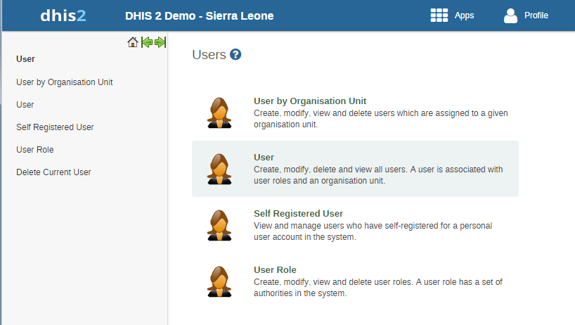
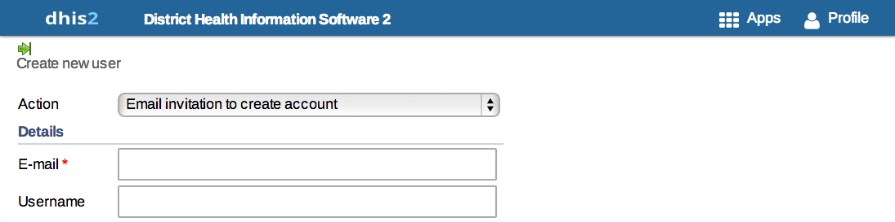

..index:: User Management

User Management
===============

iROAD2 allows for multiple users to access the system simultaneously, each with a defined set of permissions. These permissions can be finely tuned so that certain users can only enter data, while others may generate reports. Multiple user roles can be created, each with their own set of permissions, and then assigned to users which grant them certain privileges within the system. This chapter describes how to manage users and user roles.

Creating new users and roles
----------------------------

This section will describe how to add new users and manage existing users to the iROAD2 application. You can create as many user names as you need. Each user can be assigned certain privileges, and can be assigned to certain organisation units for which they will be enabled to enter data on behalf of. To access the user module, choose Users from the Apps menu and then click "User" from the menu items on the left-hand pane

User maintenance
^^^^^^^^^^^^^^^^

.. _select_user_menu:

   
You can search for specific user names in the user list by entering the name in the Filter by name field as shown above. Some non-standard functions are available by clicking on each user in the list:

Replicate: This will create an exact copy of the user. You will be asked to enter a new username and password for the replicated account.

Disable: This will disable the user, meaning that the account is not deleted, but the user will not be able to log in or use it.

User role management
^^^^^^^^^^^^^^^^^^^^
As part of creating a user name you are required to define the user role. Do so by clicking on User Role on the left side of the displayed screen. This will lead you to the User role management page where you can click on Add new to create a new role.

.. _add_user_role:

   
The following screen will open and here in the first text box you need to give a Name of the Role such as Super User, Admin User, etc. The second text box called Description gives more information about the type of User Role that is being created for e.g. State Admin User, District Data Entry.

.. _role_maintenance_page:
.. figure::  images/role_maintenance_page.png
   :align:   center
   
Next you will specify the particular data set(s) that are to be made available to the particular role. You will also need to specify the type of Authority to be given to the particular user. For each of the three options namely Datasets, Reports and Authorities user can select multiple options from the scroll down menu provided against each field. A user can choose multiple options either by moving them one-by-one.

In order for particular users to be able to enter data, you must add them to both a dataset as well as an organisational unit level. You can also select multiple datasets individually by pressing the Ctrl key on the keyboard and clicking on individual datasets.

Finally when you have entered the required fields click on Save which is located on the lower part of the displayed screen. The desired user role and related authorisation will be saved to the database, and can then be assigned to a particular user.

User management
^^^^^^^^^^^^^^^
Under particular user role there can be more than one user. To manage users, click on User on the left side of the screen. This will lead you to the User management page.

To add a new user, follow these steps:

#. Click on the Add New button.

#. Choose whether you want to fill in all the personal user information now, or invite the user by email to complete the rest of the user information:

* Create account with user details - Choose this if you would like to enter all the details of the new user such as name, password, etc.

If you choose this action, then enter the following information: username, password, surname, first name, E-mail, OpenID account (if any) and mobile phone number (if any).

After you finish adding the user, the account will be ready for them to use with the username and password that you supply.

.. _user_management_details:
.. figure::  images/user_management_details.png
   :align:   center
   
* Email invitation to create account - Choose this if you would like to send by email an invitation for the user to return to the system and finish setting up their user account. The user will then return to the system and fill in most of their personal information. The account that the user finishes setting up will be limited according to how you configure it below.

Note that you may not select this option to create an account with "critical" system authorities such as All, Scheduling Administration, Perform maintenance tasks, Merge organisation units, Eliminate duplicate data elements, Sql View Management, Change system settings, and List, Add or Delete user roles.

If you choose this action, then enter the email address to which the invitation should be sent. If you want to, you may also enter the user name that the account will have. If you leave the username empty, then the user may choose their own username when they respond to the invitation (as long as it is not taken already for another user.)

After you finish adding the new user, two emails will be sent to the address you provided. One contains a unique web link by which the user can return to the system and activate their account by entering the rest of their user information. The other email contains a unique code that they must enter into the system in order to complete the registration, after following the link in the first email. The user must finish setting up the account within three months, or the invitation becomes invalid.

.. _user_management_invite:

#. Select the Interface language for the user. You may choose a language into which fixed elements of the iROAD2 user interface have been translated.

#. Select the Database language for the user. You may choose a language into which implementation-supplied items have been translated in the database, for example data element names, organisation unit level names, etc.

#. Users must be assigned to at least one data capture and maintenance organisation unit. Users will have access to all children of the organisation units which have been assigned to them. For instance, if a user has been assigned to a district which has several facilities contained in the district, the user would have access to the district's data, as well as all of the facilities contained within the district. The data approval organisation units control for which organisation units the user can do data entry.

#. Users can be assigned to any number of data view organisation units. This controls which organisation units the user can view aggregated data for in analysis modules. Giving access to an organisation unit implicitly gives access to all organisation unit below it in the organisation unit hierarchy. Note that data view organisation units are optional. If you do not specify any, the user will have access to the full organisation unit hierarchy for viewing aggregated data.

In several places in the analysis modules one can select "user organisation unit" for the organisation unit dimension. This mechanism will first attempt to use the data view organisation units linked to the current user. If not found, it will use the data capture organisation units.

.. _user_management_fewer_options:
.. figure::  images/user_management_fewer_options.png
   :align:   center
   
#. (Click on Show more options.) You may optionally assign users to user groups on this page.

#. (Click on Show more options.) You may optionally restrict the values this user sees in data analytics by selecting dimensions that will restrict the users view. For example, let's say you have defined Implementing Partner as a category option group set, and you have shared with this user only one or more specific implementing partners (category option groups.) If you want to insure that the user does not see totals in analytics that include values from other groups, assign Implementing Partner to this user. This insures that any data visible to the user through iROAD2 analytics will be filtered to select only the Implementing Partner category option group(s) which are visible to the user.

.. _user_management_more_options:
.. figure::  images/user_management_more_options.png
   :align:   center

#. Click on the Add button to complete adding the new user.

The recently created new user can be seen in main User management screen

You can edit (like password, surname, etc.) and delete the details of new/old users by selecting corresponding Users Edit and Remove menu options.

User by organisation unit
-------------------------
The User by organisation unit function allows you see which users have been assigned to a particular organisation unit. Simply select the organisation unit from the tree on the left, and a list of users which have been assigned to this particular organisation unit will be displayed

Managed users
-------------
iROAD 2 supports a concept for user management referred to as managed users which which allows to explicitly define which users should be allowed to manage or modify which users. To "manage a user" implies that you can see and modify that user. The basic concept for user management is that you can see and modify users which you have been granted all of the authorities; in other words you can modify users which have a subset of your own authorities. The managed users concept gives you greater control over this.

The managed users concept allows you to define which users should be able to manage which users. This is configured through user groups and memberships within such groups. A user group can be configured to be allowed to manage other user groups from the standard add and update user interface. The effect is that a specific user can manage all users which are members of user groups which can be managed by a user group that the user is member of. In other words, users can be managed by all members of user groups which are managing user groups they are member of.

To enable this concept you should grant users the authority to "Add/update users within managed groups", and not grant access to the standard "Add/update users" authority. An implication of the managed users concept is that when creating a user with the "Add/update users within managed groups" only, the user must be made a member of at least one user group that the current user can manage. If not, the current user would lose access to the user being created immediately. This is validated by the system.

When granted the "Add/update users within managed groups" authority, the system lets a user add members to user groups for which the have read-only access to. The purpose of this is to allow for desentralized user management. You may define a range of user groups where other users may add or remove members, but not remove or change the name of the group.

OpenID Support
--------------
iROAD 2 supports the OpenID standard, which allows third party login using a OpenID provider, please see http://openid.net for more information. To create a custom OpenID URL for a username you can visit this URL and log in with your OpenID provider: http://openid-provider.appspot.com.

To enable support for this in iROAD 2, two steps must be done:

Set your OpenID provider: This can be done inside system settings, under "Access". Here you can set both the OpenID provider, and also the label to display on the login page to login with this provider (defaults to Login with OpenID).

Set the OpenID identifier on the user: For every user that should be able to login with his openid identifier, you will need to set this on the user itself. This can be done in user management, under the email field, there is noe a field called OpenID which can be used to fill in the OpenID identifier.

   
   
